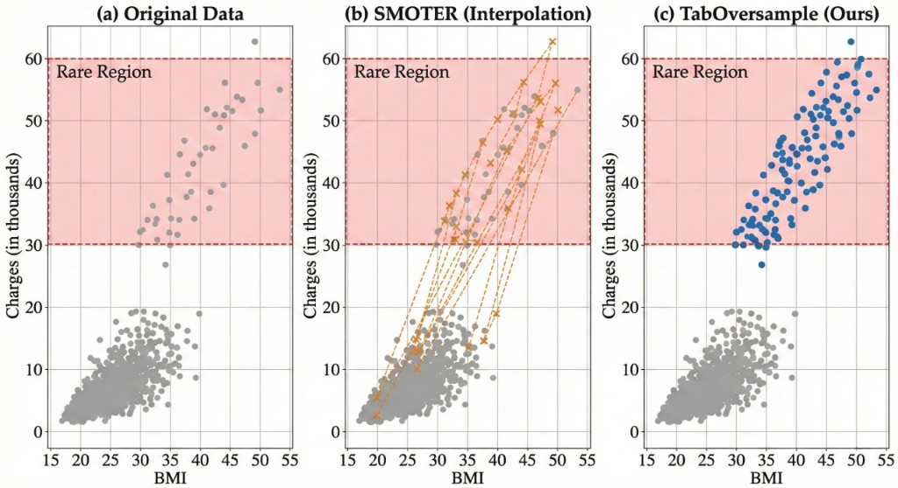
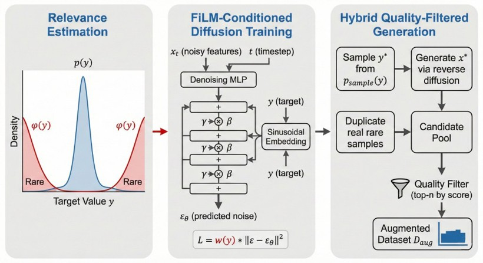

# HFPS Tabular Diffusion Synthesis

A diffusion-based synthetic data generator for the **2024 Korean Household Finance and Welfare Survey** (가계금융복지조사). Given a real survey table with **18,314 rows** and **27 columns** (11 numeric + 16 categorical), the model learns the joint distribution in a continuous latent space and generates a privacy-preserving synthetic copy that faithfully reproduces marginal distributions, inter-column correlations, and downstream predictive utility.

## Key results

| Metric | Ours (Diffusion) | CTGAN | TVAE |
|--------|:-:|:-:|:-:|
| Avg KS (numeric fidelity) | **0.0140** | 0.1331 | 0.1057 |
| Avg TVD (categorical fidelity) | **0.0192** | 0.0937 | 0.1072 |
| Correlation Diff (Frobenius) | **0.6252** | 1.2702 | 1.2228 |
| TSTR Classification Acc | **0.9362** | 0.5417 | 0.7972 |
| TSTR Classification F1 | **0.9337** | 0.4465 | 0.6859 |

Evaluated over three random seeds (42, 123, 456) with LightGBM as the downstream model. Full protocol in [Evaluation](#evaluation).

---

## Proposed method

### Motivation

Generating realistic synthetic tabular data is fundamentally harder than image synthesis for two reasons: (1) tables contain a **heterogeneous mix** of numeric and categorical columns with very different statistical properties, and (2) the **inter-column dependency structure** (correlations, conditional distributions) must be preserved for the synthetic data to be useful in downstream analytics. GAN-based approaches (CTGAN, TVAE) address the mixed-type challenge through mode-specific normalization, but often suffer from mode collapse and poor correlation preservation, especially when the number of categorical levels is large.

We take a different approach grounded in **Denoising Diffusion Probabilistic Models (DDPM)**. The core idea is to map every row of the mixed-type table into a **single, uniformly continuous latent vector** where all dimensions live in approximately standard-normal space, then train a standard Gaussian diffusion model in that space. This avoids one-hot encoding entirely (which is catastrophically incompatible with Gaussian noise) and eliminates the adversarial training instability of GANs.

### Overview

The pipeline has three stages:

1. **Encode** each survey row into a continuous latent vector via Gaussian quantile encoding (categoricals) and quantile-normalization (numerics).
2. **Train** an unconditional DDPM that learns to denoise the latent vectors.
3. **Decode** synthetic latent samples back to valid table rows by inverting the encoding.

### Stage 1: Latent construction (encoding)

Let a survey row be $\mathbf{x} = (x_1, \ldots, x_{27})$ with 11 numeric and 16 categorical columns. We define an encoder $E$ that maps $\mathbf{x}$ to a continuous vector $\mathbf{z}_0 = E(\mathbf{x}) \in \mathbb{R}^{27}$ with **no dimensionality expansion** (i.e., no one-hot encoding).

**Numeric columns.** For each numeric column $j$, we apply a two-step normalization:

$$
x_j \;\xrightarrow{\text{QuantileTransformer}}\; \tilde{x}_j \;\xrightarrow{\text{StandardScaler}}\; z_j
$$

The QuantileTransformer maps the empirical CDF to a standard normal distribution, effectively Gaussianizing any skewed or heavy-tailed marginal. Outputs are clipped to $[-4.5, 4.5]$ to prevent extreme quantile artifacts. The subsequent StandardScaler enforces strict zero mean and unit variance on the training set.

**Categorical columns.** For categorical column $j$ with $K_j$ ordered levels $v_{j,1}, \ldots, v_{j,K_j}$, we assign each level a deterministic position on the standard normal quantile grid:

$$
z_j(v_{j,i}) = \Phi^{-1}\!\left(\frac{i - \tfrac{1}{2}}{K_j}\right), \quad i = 1, \ldots, K_j
$$

where $\Phi^{-1}$ is the inverse standard-normal CDF. This places categories as evenly-spaced quantile points in $\approx [-2.5, 2.5]$, preserving ordinal structure where it exists and ensuring the encoded values are compatible with Gaussian noise. For example, a binary column ($K=2$) maps to $\{-0.674, +0.674\}$; a 6-level column spreads across $\{-1.38, -0.67, -0.21, +0.21, +0.67, +1.38\}$.

**Result.** Every row becomes $\mathbf{z}_0 \in \mathbb{R}^{27}$ with all dimensions in smooth, approximately standard-normal space — ideal for DDPM.

### Stage 2: Diffusion model (DDPM)

We train a standard **Denoising Diffusion Probabilistic Model** on the encoded vectors $\{\mathbf{z}_0^{(i)}\}_{i=1}^{N}$.

**Forward process.** Given a clean latent $\mathbf{z}_0$, the forward process adds Gaussian noise over $T = 1000$ timesteps according to a variance schedule $\beta_1, \ldots, \beta_T$. Defining $\alpha_t = 1 - \beta_t$ and $\bar{\alpha}_t = \prod_{s=1}^{t} \alpha_s$, the noisy version at any timestep $t$ can be sampled in closed form:

$$
q(\mathbf{z}_t \mid \mathbf{z}_0) = \mathcal{N}\!\left(\mathbf{z}_t;\; \sqrt{\bar{\alpha}_t}\,\mathbf{z}_0,\; (1 - \bar{\alpha}_t)\,\mathbf{I}\right)
$$

$$
\mathbf{z}_t = \sqrt{\bar{\alpha}_t}\,\mathbf{z}_0 + \sqrt{1 - \bar{\alpha}_t}\,\boldsymbol{\epsilon}, \quad \boldsymbol{\epsilon} \sim \mathcal{N}(\mathbf{0}, \mathbf{I})
$$

We use the **cosine** $\beta$-schedule (Nichol & Dhariwal, 2021), which provides more uniform signal-to-noise progression than the linear schedule and works especially well in low-dimensional settings.

**Training objective.** The model learns a denoiser $\boldsymbol{\epsilon}_\theta(\mathbf{z}_t, t)$ that predicts the noise $\boldsymbol{\epsilon}$ added at timestep $t$:

$$
\mathcal{L}_{\text{DDPM}} = \mathbb{E}_{\mathbf{z}_0,\, \boldsymbol{\epsilon},\, t} \left[\left\|\boldsymbol{\epsilon} - \boldsymbol{\epsilon}_\theta(\mathbf{z}_t, t)\right\|_2^2\right], \quad t \sim \text{Uniform}\{1, \ldots, T\}
$$

**Denoiser architecture.** The noise predictor $\boldsymbol{\epsilon}_\theta$ is an MLP with:

- **Sinusoidal timestep embeddings** (128-dim) concatenated with $\mathbf{z}_t$ as input
- **6 residual blocks**, each: Linear $\to$ SiLU $\to$ Dropout $\to$ Linear + skip connection $\to$ SiLU
- Hidden dimension **512** throughout ($\approx 3.25 \times 10^6$ learnable parameters)
- Output dimension matches input (27)

**Training details:**

| Component | Setting |
|-----------|---------|
| Optimizer | AdamW (weight decay $1 \times 10^{-5}$) |
| Learning rate | $1 \times 10^{-3}$ with cosine annealing to $1 \times 10^{-5}$ |
| Batch size | 256 |
| Epochs | 1,500 |
| Gradient clipping | Global norm $\leq 1.0$ |
| EMA decay | 0.999 (sampling uses EMA weights) |

**Reverse process (sampling).** To generate new data, we start from pure noise $\mathbf{z}_T \sim \mathcal{N}(\mathbf{0}, \mathbf{I})$ and iteratively denoise using the learned model:

$$
\mathbf{z}_{t-1} = \frac{1}{\sqrt{\alpha_t}}\left(\mathbf{z}_t - \frac{\beta_t}{\sqrt{1 - \bar{\alpha}_t}}\,\boldsymbol{\epsilon}_\theta(\mathbf{z}_t, t)\right) + \sigma_t\,\mathbf{w}, \quad \mathbf{w} \sim \mathcal{N}(\mathbf{0}, \mathbf{I})
$$

where $\sigma_t = \sqrt{\beta_t}$. After each reverse step, we **clamp** $\mathbf{z}_t$ to $[-6, 6]$ to prevent occasional divergence in the tails.

### Stage 3: Decoding (post-processing)

The decoder $D = E^{-1}$ maps synthetic latents $\hat{\mathbf{z}}_0$ back to valid table rows:

- **Numeric columns:** inverse StandardScaler $\to$ inverse QuantileTransformer $\to$ clip to training-data min/max $\to$ round to integer.
- **Categorical columns:** for each dimension, snap to the nearest quantile center $z_j(v_{j,i})$ and output the corresponding category code $v_{j,i}$.

This guarantees that every synthetic row has valid, in-domain values with no missing entries.

### Connection to TabOversample (UAI submission)

This codebase shares its DDPM backbone with our **TabOversample** method submitted to UAI, which addresses a different problem: **imbalanced regression** via conditional diffusion with relevance-weighted loss $w(y)\,\|\boldsymbol{\epsilon} - \boldsymbol{\epsilon}_\theta(\mathbf{x}_t, t, y)\|^2$ and FiLM conditioning on the target $y$. The HFPS deployment here uses **unconditional** joint diffusion over all 27 dimensions without any target variable, relevance weighting, or FiLM layers. The figures below are from the UAI paper for conceptual context only.

<p align="center">

</p>

<p align="center"><em>Figure 1: Motivating example from the UAI TabOversample paper — rare-region oversampling comparison. The HFPS deployment here does not perform conditional oversampling.</em></p>

<p align="center">

</p>

<p align="center"><em>Figure 2: TabOversample framework (UAI). HFPS uses the same DDPM backbone but without FiLM conditioning, relevance weighting, or quality filtering.</em></p>

### Why not one-hot encoding?

One-hot encoding expands the 16 categorical columns into ~50+ binary dimensions. Binary 0/1 vectors are fundamentally incompatible with continuous Gaussian noise: small prediction errors get amplified by argmax decoding, and the high-dimensional sparse space drowns out the 11 numeric dimensions. In our experiments, one-hot + DDPM produced catastrophically diverged samples. Gaussian quantile encoding keeps all 27 dimensions continuous and in $[-4.5, 4.5]$, which is exactly what DDPM expects.

---

## Project structure

```
hfps-tabular-diffusion/
├── assets/                         # README figures
│   ├── uai_fig1_rare_region_comparison.png
│   └── uai_fig2_taboversample_framework.png
├── src/
│   ├── config.py                   # Column schema, hyperparameters, paths
│   ├── preprocessing.py            # TabularPreprocessor (quantile + Gaussian encoding)
│   ├── model.py                    # Wrapper around TabularDiffusion backbone
│   ├── train.py                    # Training entrypoint (CLI)
│   └── sample.py                   # Sampling entrypoint (CLI)
├── diffusion/
│   └── diffusion.py                # Core DDPM: schedules, denoiser MLP, EMA, sampling
├── evaluation/
│   ├── config_eval.py              # Evaluation settings (seeds, tasks, splits)
│   ├── load_data.py                # CSV loaders and train/val/test splitting
│   ├── fidelity.py                 # Tier A: KS, TVD, correlation diff
│   ├── detection.py                # Tier B: real-vs-synthetic classifier
│   ├── tstr.py                     # Tier C: Train-on-Synthetic, Test-on-Real
│   ├── baselines.py                # CTGAN / TVAE baseline training
│   └── run_all.py                  # CLI entrypoint for full evaluation
├── smoke_test.py                   # Quick end-to-end sanity check
├── requirements.txt                # Python dependencies
├── .gitignore
└── README.md
```

> **Note:** The real survey data (`2024_가계금융복지조사_final.csv`) and generated synthetic data (`output/synthetic.csv`) are **not included** in this repository due to confidentiality. The code is fully functional — supply your own CSV with the same 27-column schema to reproduce the pipeline.

---

## Setup and quick start

### Requirements

Python 3.9+, PyTorch 2.0+. All computation runs on **CPU only** — no GPU required.

```bash
pip install -r requirements.txt
```

### Quick start

**1. Smoke test** — end-to-end sanity check in ~60 seconds:

```bash
python smoke_test.py
```

**2. Full training** — 1,500 epochs on 18,314 rows (~45 min on CPU):

```bash
cd src
python train.py
```

Outputs: `checkpoints/model.pt`, `preprocessor.pkl`, `hyperparams.json`, `train_summary.json`.

**3. Generate synthetic data** (~5.5 min for 1,000 reverse-diffusion steps):

```bash
cd src
python sample.py
```

Output: `output/synthetic.csv` (UTF-8 with BOM).

**4. Run evaluation** (requires CTGAN/TVAE packages):

```bash
cd evaluation
python run_all.py
```

**5. Custom usage:**

```bash
cd src
python sample.py --n-samples 5000
python train.py --epochs 100
python train.py --smoke
```

---

## Output specification

| Property | Value |
|----------|-------|
| Rows | 18,314 |
| Columns | 27 (11 numeric + 16 categorical) |
| Encoding | UTF-8 with BOM |
| Numeric range | Bounded by training data min/max |
| Categorical values | Strictly in-domain |
| Missing values | None |

---

## Hyperparameters

| Parameter | Full Training | Smoke Test |
|-----------|:---:|:---:|
| Timesteps $T$ | 1,000 | 50 |
| Hidden dim | 512 | 64 |
| Residual blocks | 6 | 2 |
| $\beta$-schedule | cosine | cosine |
| Batch size | 256 | 64 |
| Learning rate | $1 \times 10^{-3}$ | $1 \times 10^{-3}$ |
| Epochs | 1,500 | 2 |
| EMA decay | 0.999 | 0.999 |
| Gradient clip norm | 1.0 | 1.0 |

---

## Evaluation

Synthetic quality is assessed under a three-tier protocol for fair comparison against **CTGAN** and **TVAE** baselines.

### Protocol

| Item | Value |
|------|-------|
| Classification task | Predict `소득계층구간코드(보도용)(보완)` (6 classes) from 26 features |
| Regression task | Predict `경상소득(보완)` from 26 features |
| Train / val / test split | 70 / 15 / 15 |
| Random seeds | 42, 123, 456 |
| Downstream model | LightGBM (500 trees, max depth 6, lr 0.05) |
| Baselines | CTGAN (300 epochs), TVAE (300 epochs) |

### Results

**Fidelity** — lower is better:

| Method | Avg KS | Avg TVD | Corr Diff (Frobenius) |
|--------|:---:|:---:|:---:|
| **Ours (Diffusion)** | **0.0140** | **0.0192** | **0.6252** |
| CTGAN | 0.1331 | 0.0937 | 1.2702 |
| TVAE | 0.1057 | 0.1072 | 1.2228 |

**TSTR Classification** (소득계층구간코드) — higher is better:

| Method | Accuracy | Macro-F1 |
|--------|:---:|:---:|
| Real (TRTR, upper bound) | 0.9958 &plusmn; 0.0012 | 0.9953 &plusmn; 0.0015 |
| **Ours (Diffusion)** | **0.9362 &plusmn; 0.0081** | **0.9337 &plusmn; 0.0107** |
| TVAE | 0.7972 &plusmn; 0.0140 | 0.6859 &plusmn; 0.0168 |
| CTGAN | 0.5417 &plusmn; 0.0064 | 0.4465 &plusmn; 0.0211 |

**TSTR Regression** (경상소득) — lower RMSE / higher R&sup2; is better:

| Method | RMSE | R&sup2; |
|--------|:---:|:---:|
| Real (TRTR, upper bound) | 7,397 &plusmn; 603 | &minus;0.247 &plusmn; 0.094 |
| **Ours (Diffusion)** | **5,190 &plusmn; 1,979** | **0.336 &plusmn; 0.445** |
| CTGAN | 5,082 &plusmn; 475 | 0.393 &plusmn; 0.151 |
| TVAE | 7,278 &plusmn; 1,095 | &minus;0.212 &plusmn; 0.260 |

### Training summary

| Quantity | Value |
|----------|-------|
| Training rows | 18,314 |
| Latent dimension | 27 |
| Epochs | 1,500 |
| Learnable parameters | 3,245,595 |
| Wall time | ~44 min (CPU) |
| Final MSE loss | 0.1756 |

---

## Citation

If you find this code useful, please cite:

```bibtex
@misc{kang2026hfps,
  author = {Kang, Nathaniel},
  title  = {HFPS Tabular Diffusion Synthesis},
  year   = {2026},
  url    = {https://github.com/nathanielkang/hfps-tabular-diffusion}
}
```

## Author

**Nathaniel Kang**
School of Computer Science and Engineering, IT College
Kyungpook National University
[natekang@knu.ac.kr](mailto:natekang@knu.ac.kr)

## License

This project is released under the [MIT License](LICENSE).
